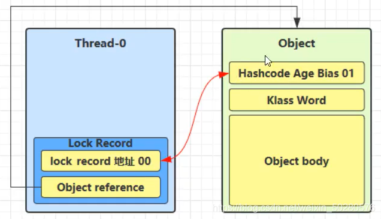
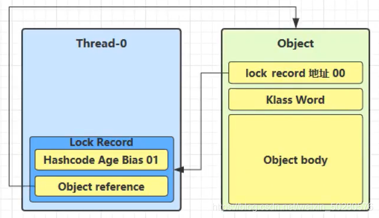

## 并发编程学习

### Synchronized底层操作之Monitor

- Monitor为监控者或称为管程，每个java对象都可以关联一个monitor对象，如果使用Synchronized来进行加重量级锁的话，会在Mark word中存放monitor地址，来与monitor对象相关联。

- 在synchronized代码块中操作时，被锁住的对象的对象头中的Mark Word会发生变化


- mark word主要为64bit,根据对象的不同状态，对象头的内容也不一致，Normal(正常)，Biased(偏离锁)，Lightweight Locked(轻量级锁)，Heavyweight Lock(重量级锁)。

- 在进入synchronized代码块操作之后，对象头中的Mark Word内容与Monitor进行绑定

- **Monitor的内部结构**：

  - owner：即当前拿到锁的线程
  - EntryList：未拿到锁的其他阻塞线程 ，当owner释放锁的时候，entryList中的线程重新竞争锁（非公平）。
  - WaitSet：当线程拿到锁的时候，因为某种原因需要让出cpu资源，也就是调用了wait方法或者join方法，线程进入WAITING或者TIME_WAITING状态时，线程进入WaitSet

  


### 锁膨胀

- 当锁没有竞争关系的时候，使用的是偏量锁
- 当锁开始有竞争的时候，会膨胀为轻量锁 
- 当锁竞争激烈的时候，膨胀为重量级锁

### 轻量级锁加解锁过程

- 轻量级锁尝试加锁的时候，锁记录的对象指针 Object Reference 会指向被加锁的对象，锁记录会和被锁住的对象头中mark word进行CAS交换操作，只有对象头mark word中最后两位为01 且无偏向记录的时候CAS才会成功，也即加锁成功

- 加锁成功之后，对象的对象头储存的就是锁记录的地址和状态 00 表示轻量级锁
- 如果CAS交换失败，则对应两种情况：
  - 其他线程已经加锁，存在竞争现象，进入锁膨胀阶段。
  - 线程自己本身执行了锁的重入，则添加一条Lock Record作为重入的计数
  
  
### wait/notify 
- **执行原理**

  - 在锁的竞争过程中拿到锁的线程称为owner线程，处于RUNNING状态，未拿到锁的线程处于BLOCKED状态

  - 当owner线程发现此时执行条件并不满足时，便会调用wait()方法使当前owner线程进入waitSet中，此时线程状态变为WAITING**并释放锁**

  - 当条件满足的时候，由owner线程调用notify/notifyAll 来唤醒处于waitSet中的线程

  - wait/notify 只有owner线程可以调用
  //todo 补图


- **sleep和wait的区别**
  - sleep是Thread的静态方法，wait是Object的实例方法
  - 只有owner线程才可以调用wait方法，即wait需要和synchronized配合使用，而sleep不需要
  - sleep不会释放锁，wait会

- **sleep和wait共同点**
  - 线程所处状态一致（WAITING）
  
- **解决虚假唤醒**
  
  ```
  synchronized(lock){
      while(条件不满足){
          lock.wait();
      }
      //条件成立，执行操作;
      break;
  }
  
  //另外一个线程
  synchronized(lock){
      lock.notifyAll();
  }
  ```
  
- **保护性暂停**
  - 当线程访问某个资源时，发现条件不满足则暂时挂起，等到条件满足时再执行


### 死锁、活锁、饥饿

- **死锁**
    - 当两个线程都获取到一把锁的情况下，尝试去获取对方的锁就有可能产生死锁现象
    - 死锁产生的条件：
        - 互斥条件：一个资源一次只能被一个进程使用
        - 请求与保持条件：一个进程因请求资源而阻塞时，对已获得资源保持不放
        - 不剥夺条件：进程获得的资源，在未完全使用完之前，不能强行剥夺
        - 循环等待条件：若干进程之间形成一种头尾相接的环形等待资源关系
    - 如何检测死锁：
        - 通过jstack java进程id 命令检测 （使用jps 查看java进程id）
        - 通过jconsle控制台查看
- **活锁**
    - 两个线程同时改变了对方的结束条件，导致这两个线程永远无法停止，或者单一线程执行任务不断失败重试
    - 与死锁不同，死锁是两个线程同时处于阻塞状态不可执行，而活锁是可以一直运行的
- **饥饿**
    - 某个线程由于优先级过低，从而导致一直没有被分配到CPU资料，导致无法被执行的现象成为线程的饥饿
    - 顺序加锁可以解决死锁问题，但是有可能出现饥饿现象


### ReentrantLock

- **特点**
  - 可中断：与synchronized不同，前者是当获取到锁的时候，如果条件不满足可以调用wait方法让出锁和cpu资源，而后者是可以在等待获取锁的时候被打断，从而避免死锁。
  - 可以设置过期时间
  - 可以设置为公平锁
  - 支持多个条件变量
  - 支持可重入
- **条件变量**
  - 与synchronized不同，synchronize的是把不满足条件的线程放在waitset休息室中进行等待，而ReentrantLock支持多个休息室，即Condition对象
  - 使用流程（类似wait/notify）：
    - await（类似wait）前需要获取锁
    - await执行后会释放锁
    - await线程被唤醒或打断之后重新竞争锁，竞争成功则继续执行

### java内存模型

- **可见性**：
    - ```java
      static boolean run=true;
          public static void main(String[] args) throws InterruptedException {
              new Thread(() -> {
      
                  while (run){
                      //线程执行
                  }
              }).start();
      
              TimeUnit.SECONDS.sleep(1);
      
              run=false;//线程并不会停止
              
          }
      ```

      问题分析：boolean变量run是存放在主存之中的，由于线程频繁的从主存中访问run，这时候JIT编译器会把run的值缓存到线程自己的工作内存中的高速缓存，提高性能。从而带来的问题就是，当主线程修改了run的值并且同步到主存中的时候，新开的线程还是读的旧值，导致线程并没有如预期一样停止运行，也就是一个线程对主存的修改对其他线程不可见

    - 通过 volatile关键字解决可见性问题，给变量加上volatile关键字表示线程每次都需要从主存中读取最新的值，保证共享变量在多个线程中的可见性。但是性能有所损失。
    - synchronized也可以保证共享变量在多个线程中的可见性。

- **原子性**

    - volatile 可以保证可见性但是不能保证原子性


### volatile原理

- **volatile如何保证可见性**
  - volatile通过读屏障和写屏障来保证可见性
  - 读屏障：线程对共享变量的读取总是从主存中获取，从而保证读取到最新值
  - 写屏障：线程对共享变量的修改总是会同步到主存中
- **volatile如何保证有序性**
  - volatile禁止指令重排，即在一个线程内所执行的指令顺序不会发生改变，但是无法保证指令交错（原子性）

- **dcl双检锁**

  ```java
  public class Singleton{
    //私有构造
    private Singleton(){};
    
    private static volatile Singleton instance;
    
    public static Singleton getInstance(){
      if(instance==null){
        synchronized（Singleton.class）{
          if(instance==null){
            //可能发生指令重排
            instance=new Singleton();
          }
        }
      }
      return instance;
    }
  }
  ```

  - dcl不加volatile会有什么问题？
    - instance=new Singleton() 这行代码可能会发生指令重排
    - 
    - 

- **Volatile的有序性和synchronized有什么不同？**
  - volatile修饰变量，涉及到对变量的读写操作时不会发生指令重排
  - synchronized保证代码块中和代码块外不会发生指令交错，但无法保证代码块内不会发生指令重排，如果对变量的所有操作都处于同步代码块中则不会产生任何问题
  - 