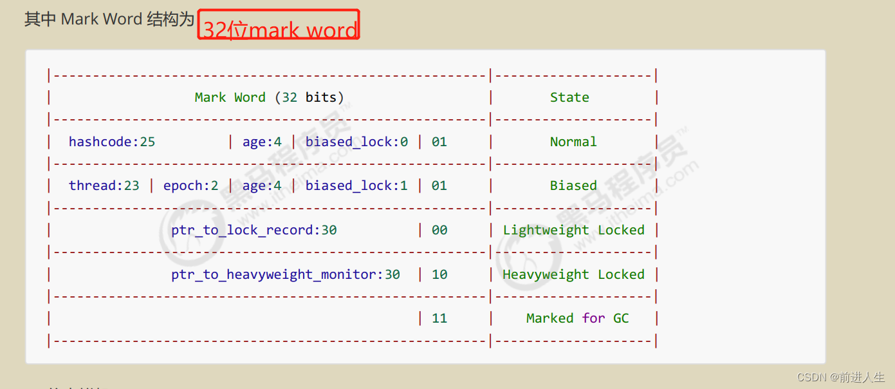

## 并发编程学习

### Synchronized底层操作之Monitor

- Monitor为监控者或称为管程，每个java对象都可以关联一个monitor对象，如果使用Synchronized来进行加重量级锁的话，会在Mark word中存放monitor地址，来与monitor对象相关联。

- 在synchronized代码块中操作时，被锁住的对象的对象头中的Mark Word会发生变化

- mark word主要为64bit,根据对象的不同状态，对象头的内容也不一致，Normal(正常)，Biased(偏离锁)，Lightweight Locked(轻量级锁)，Heavyweight Lock(重量级锁)。

- 在进入synchronized代码块操作之后，对象头中的Mark Word内容与Monitor进行绑定

- **Monitor的内部结构**：

  - owner：即当前拿到锁的线程
  - EntryList：未拿到锁的其他阻塞线程 ，当owner释放锁的时候，entryList中的线程重新竞争锁（非公平）。
  - WaitSet：当线程拿到锁的时候，因为某种原因需要让出cpu资源，也就是调用了wait方法或者join方法，线程进入WAITING或者TIME_WAITING状态时，线程进入WaitSet

  